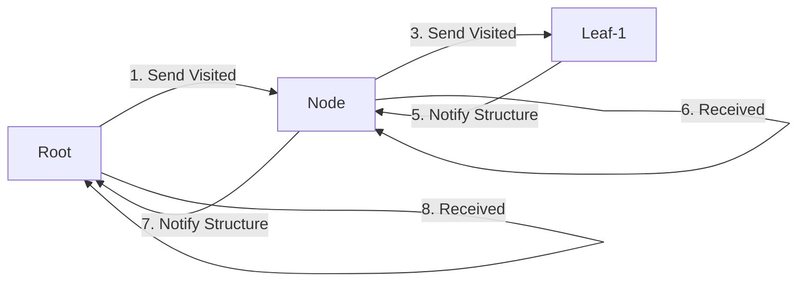
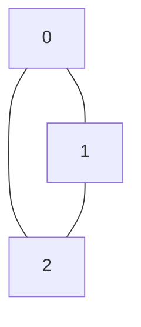
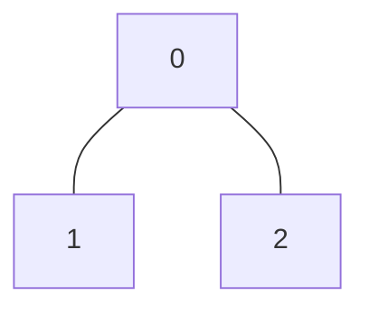
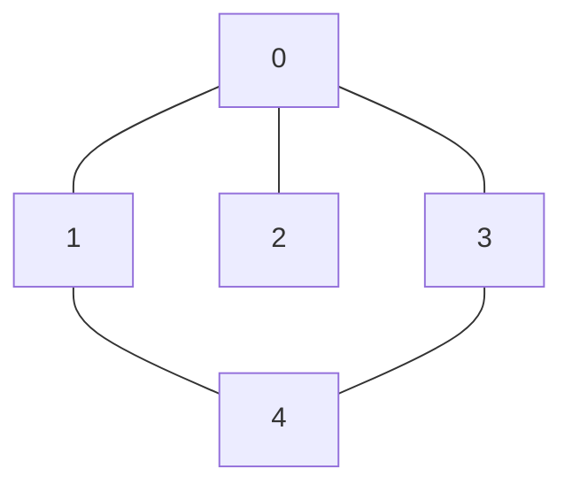
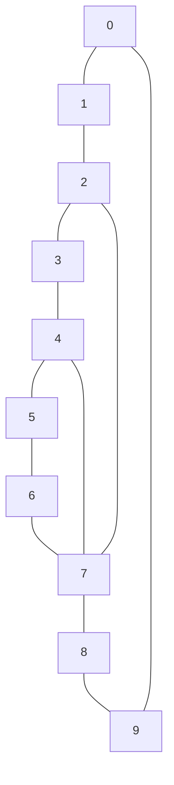
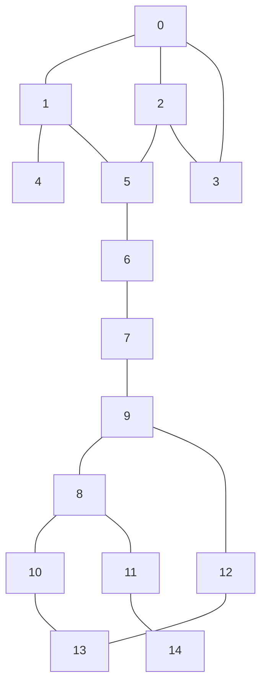

# distriputed_breadth_first_search

Implement a distributed breadth-first search algorithm in MPI, to find the diameter of a graph.

## Flow chart of DBFS



## Authors

- Elias Marcon MSc. | [@eliasmarcon](https://github.com/eliasmarcon)
- Ing. Fabian Steiner BSc.| [@fasteiner](https://github.com/fasteiner/)
- Jan Langela Regincos BSc. | [@janpilu](https://github.com/janpilu)

## Building a tree in MPI

- Index: list the cumulative edge count (if node 1 has two edges and node 2 has two edges, index 0 will be 2 and index 1 will be 4)
- edges: lists the edges of the graph (if node 1 has two edges to node 0 and node 2, edges 0 and 1 will be 0 and 2)

```c
// ---
// Full mesh

//  0
// / \
//1---2

    int n = 3;                         // Number of nodes
    int index[3] = {2, 4, 6};          // Cumulative degree of nodes
    int edges[6] = {1, 2, 0, 2, 0, 1}; // Edges in the graph

// binary tree

//   0
//  / \
// 1   2

int n = 3; // Number of nodes
int index[3] = {2, 3, 4}; // Cumulative degree of nodes
int edges[4] = {1, 2, 0, 0}; // Edges in the graph

```





### Further trees/examples

#### 5 nodes linear


#### 5 nodes

```c
int n = 5; // Number of nodes
int index[5] = {3, 5, 7, 10, 12}; // Cumulative degree of nodes
int edges[10] = {
    1, 2, 3,
    0, 4,
    0,
    0, 4
    1, 3}; // Edges in the graph
```

```c
  0
 /|\
1 2 3
 \  /
  4
```



#### 10 nodes

```c
int n = 10; // Number of nodes
int index[10] = {2, 4, 6, 8, 10, 12, 14, 16, 18, 20}; // Cumulative degree of nodes
int edges[20] = {1, 2, 0, 3, 1, 4, 2, 5, 3, 6, 4, 7, 5, 8, 6, 9, 7, 0, 8, 1}; // Edges in the graph
```

```c
0 -- 1 -- 2
|     /    |
9    /     3
|   /      |
8 - 7 ---- 4
     |    /
     6 -- 5
```



#### 15 nodes

```c
int n = 15; // Number of nodes
int index[15] = {3, 5, 8, 10, 12, 14, 16, 19, 22, 24, 26, 28, 30, 32, 34}; // Cumulative degree of nodes
int edges[34] = {
    1, 2, 3,   // Node 0
    0, 4,      // Node 1
    0, 3, 5,   // Node 2
    0, 2,      // Node 3
    1, 5,      // Node 4
    2, 4, 6,   // Node 5
    5, 7,      // Node 6
    6, 8, 9,   // Node 7
    7, 10, 11, // Node 8
    7, 12,     // Node 9
    8, 13,     // Node 10
    8, 14,     // Node 11
    9, 13,     // Node 12
    10, 12,    // Node 13
    11         // Node 14
}; // Edges in the graph
```

```c
    0 -- 1 -- 4
   /|     \
  / |      5 -- 6 -- 7 -- 9 -- 12 -- 13 -- 10 -- 8
 3  |                     |    |                 |
  \ |                     8    13 -- 12         11
   \|                   /  \                   /
    2 ---------------- 5    11 -------------- 14
```


