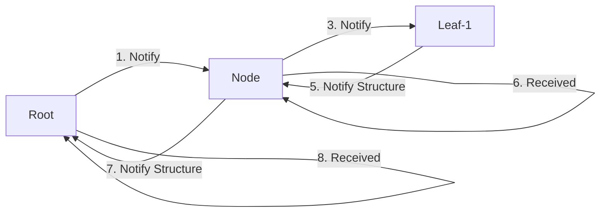
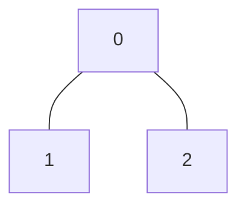
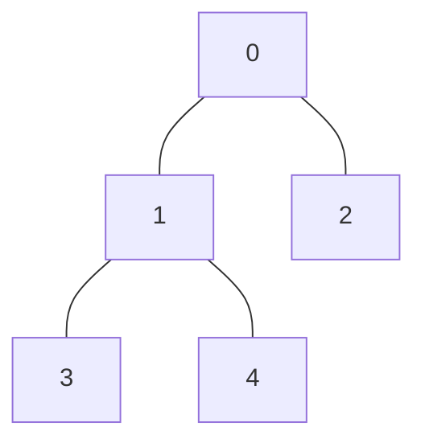

# distributed_breadth_first_search

Implement a distributed breadth-first search algorithm in MPI, to traverse a tree. If the max depth is exceeded, the program will switch to a depth-first search.

One important remark: DFS only reduces the parallelism of the algorithm, but does not change the amount of messages sent in total. Overall DFS can be slower, but helps to save switch resources.

## Flow chart of DBFS



## Authors

- Elias Marcon MSc. | [@eliasmarcon](https://github.com/eliasmarcon)
- Ing. Fabian Steiner BSc.| [@fasteiner](https://github.com/fasteiner/)
- Jan Langela Regincos BSc. | [@janpilu](https://github.com/janpilu)

## Folder Structure

- `./include`:

  - `ArrayList.h`: defines the data structure for the `ArrayList.c` file

  - `cJSON.h`: defines the data structure for the `cJSON.c` file

  - `Graph.h`: defines the data structure for the `Graph.c` file

  - `Node.h`: defines the data structure for the `Node.c` file

- `./src`:

  - `ArrayList.c`: defines functions for merging two ArrayLists, converting an ArrayList to a string representation, and checking if a specified value is present in the ArrayList

  - `cJSON.c`: external repository(#) under MIT License, grants permission for free use, modification, and distribution of the cJSON library

  - `distributed_bfs.c`: utilizes MPI for distributed computing to perform a breadth-first search (BFS) on a graph, measuring and outputting relevant metrics such as execution time, message counts, and the structure of the resulting BFS tree

  - `Graph.c`: defines functions to create and print a binary tree-based graph with a specified number of nodes, including memory allocation checks and edge generation based on the binary tree structure

  - `Node.c`: defines functions for printing children, converting a Node struct to a JSON string and vice versa, and printing the full graph starting from a given node

- `./out`: contains the executable file `mpi_distributed_bfs` for the distributed breadth-first search created through the build process

- `Makefile`: configuration file that controls the build process of the MPI program (contains rules and commands to compile the project and create the executable file `mpi_distributed_bfs`)

- `start_distributed_bfs.sh`: automates the execution of the `make all` command and MPI program (distributed breadth-first) with a user-specified number of processes and max depth (saves the results of the run in the output file `distributed_bfs_results.txt` for monitoring and analysis)

- `distributed_bfs_results.txt`: contains the results of the most recent run

- `distributed_bfs_results_DEBUG.txt`: contains a result with DEBUG and a bigger tree

## How to build

### Prerequisites

- Ubuntu 20.04
- mpich

### Build

- the `make all` command is included in the `start_distirbuted_bfs.sh` file

### Usage

To use the provided Bash script for running the distributed breadth-first search algorithm, follow these steps:

1. Ensure that MPI is installed on your system.

2. Open a terminal and navigate to the directory containing this bash script.

3. Run the bash script by providing the run_type (cluster, local), the number of MPI tasks and the desired max depth before switching to DFS as command-line arguments.

- Default Parameters:
  - run_type = local
  - number of tasks = 5
  - max depth = 5

```sh
./start_distributed_bfs.sh <run_type> <number_of_tasks> <max_depth> (replace `<run_type>` `<number_of_tasks>` and `<max_depth>` with the actual values)

./start_distributed_bfs.sh local 5 5

./start_distributed_bfs.sh cluster 10 8

```

## Building a tree in MPI

- Index: list the cumulative edge count (if node 1 has two edges and node 2 has two edges, index 0 will be 2 and index 1 will be 4)
- edges: lists the edges of the graph (if node 1 has two edges to node 0 and node 2, edges 0 and 1 will be 0 and 2)

```c
// binary tree

//   0
//  / \
// 1   2

int n = 3; // Number of nodes
int index[3] = {2, 3, 4}; // Cumulative degree of nodes
int edges[4] = {1, 2, 0, 0}; // Edges in the graph

```



### Further trees/examples

#### 5 nodes linear


```c
int n = 5; // Number of nodes
int index[5] = {1, 3, 5, 7, 8}; // Cumulative degree of nodes
int edges[10] = {
    1       // Node 0
    0, 2,   // Node 1
    1, 3,   // Node 2
    2, 4,   // Node 3
    3       // Node 4
};          // Edges in the graph
```

#### 5 Nodes Binary Tree



```c
int n = 5; // Number of nodes
int index[5] = {2, 5, 6, 7, 8}; // Cumulative degree of nodes
int edges[10] = {
    1, 2,       // Node 0
    0, 3, 4,    // Node 1
    0,          // Node 2
    1,          // Node 3
    1           // Node 4
};              // Edges in the graph
```
